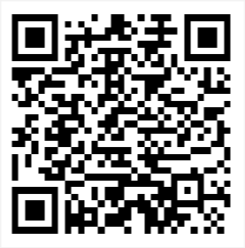

# Welcome! 👋

Hi, I'm Aguirre Matteo, a student from a Tech School in Argentina.
I started to use Linux in 2024 and rapidly fell in love with the open source
community and I'm willing to become a Linux SysAdmin. Right now I'm daily driving NixOS
and code stuff that I need, but I also like to contribute when I find a bug or smth.

I've studied English for around 2-3 years, but mainly acquired it due to fully
immersing myself in it, and by only consuming content in that language.
I could say I'm proficient at reading and writting text in English, but I still
need to practice my pronounciation.

I also self-studied Calculus and other advanced Math topics such as Linear Algebra
and Differential Equations. I've a great foundation in Algebra, which made it easier
to learn those topics.

#

  
<h2>📬Contact</h2>

  <ul>
    <li>Email: aguirre-matteo@proton.me</li>
    <li>Matrix: <a href="https://matrix.to/#/@aguirre-matteo:matrix.org">@aguirre-matteo</a></li>
    <li>Signal: <a href="https://signal.me/#eu/EKwH6mesyBpG4JelNxlBOl0FNka7FzR1ywv4iK6a8SluO2wnlMZEUJJYWA1aupn8">Matteo</a></li>
    <li>Telegram: <a href="https://t.me/introvertedintuitionnn">@introvertedintuition</a></li>
  </ul>

  
<h2>🪙Donate</h2>

  <ul>
    <li>Monero: 86m7fiwx2C9ZxKGmtYNZFDcreBghvvvJzGpbif1JpuY5U8iskz2TRjJeousLB5cC1UZk2zeL1zK9d7iwKemYccNg3KTAMNy
    

      
Show QR Code

      
    

    </li>
    <li>BTC: bitcoin:bc1qgd7a6m045g779yswq4nrq7auzysg5cd6wds5vm
    

      
Show QR Code

      
    

    </li>
  </ul>

